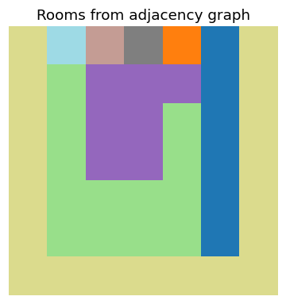

# rectangular-floorplan

Turn a planar graph of room adjacencies into a rectangular floorplan: a grid
where every room is a filled rectangle and rooms joined by an edge end up
touching. This is the *rectangular dual* problem, which shows up in
architectural layout and VLSI floorplanning.



The picture above is produced by `examples/demo.py` from a 13-node adjacency
graph. Each colour is one room.

## The idea

Given a planar graph drawn with fixed node positions, the algorithm:

1. Builds a **rotation system** — for each vertex, its neighbours sorted by the
   angle of the edge to them. This is the combinatorial embedding, and it turns
   face traversal into a mechanical "next neighbour in angular order" step.
2. **Gift-wraps the outer boundary** and **numbers the interior faces** as rooms,
   both using that rotation system.
3. **Peels the boundary inward one ring at a time.** Each ring is painted into a
   matrix, its edges are removed, and the algorithm recurses on the smaller
   graph. A segment tree gives fast range-max queries for deciding how many rows
   each room's rectangle spans.
4. A final **flood fill** closes any leftover cells.

## Layout of the code

```
floorplan/
  geometry.py      pure point predicates (angle, distance)
  embedding.py     rotation system, outer boundary, face labelling
  segment_tree.py  iterative segment tree used by the packing step
  layout.py        hull splitting, ring-by-ring packing, flood fill
  dualization.py   experimental: triangulate a graph (see below)
  plotting.py      matplotlib helpers
examples/demo.py   reproduces the floorplan above
tests/             regression test that pins the example output
```

Modules are ordered by dependency: `geometry` knows nothing about graphs,
`embedding` builds on it, `layout` builds on both plus the segment tree.

## Running it

```bash
pip install -r requirements.txt
python -m examples.demo        # prints the room grid
pytest                         # runs the regression test
```
